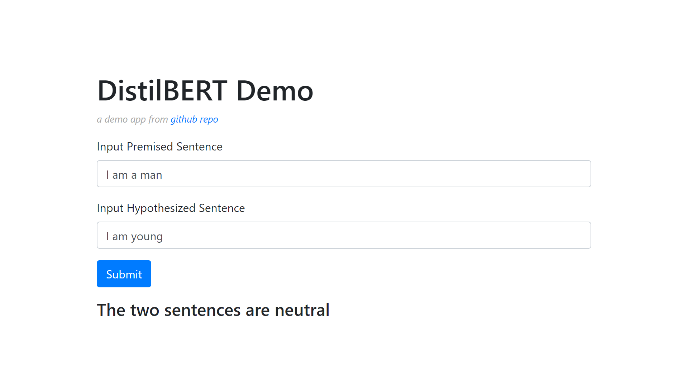
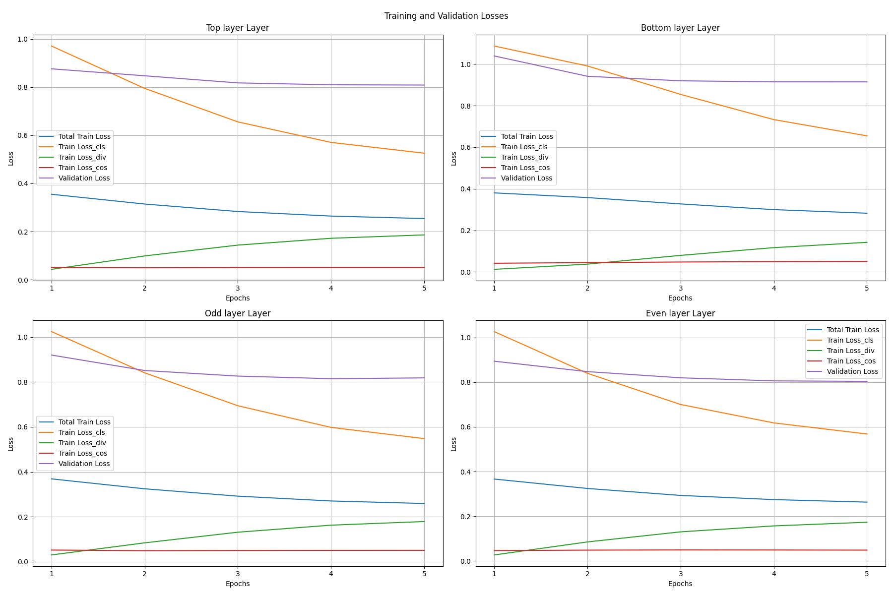
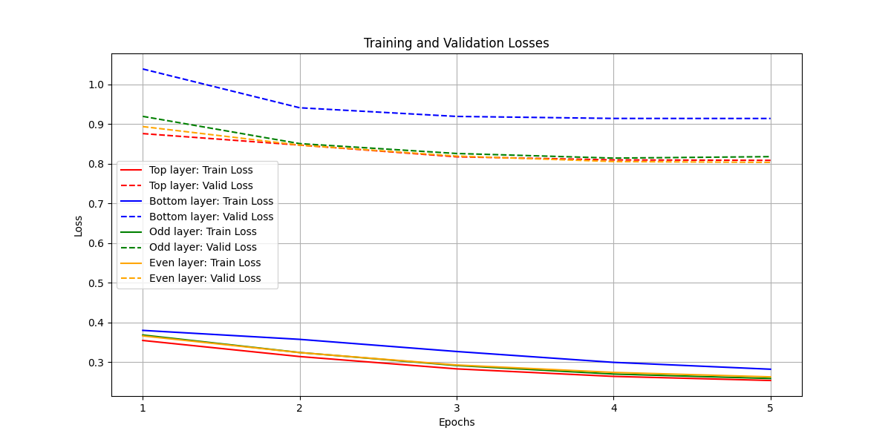
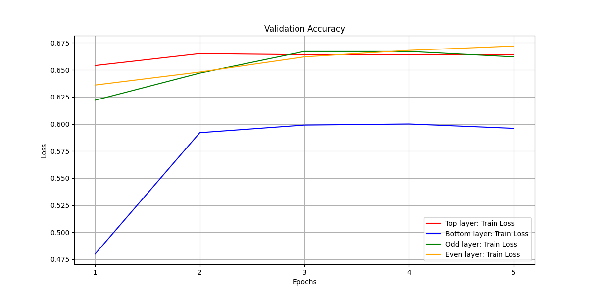

# DistilBERT demo

## Overview

   Welcome to the DistilBERT Demo App! This web-based application demonstrates the basic functionality of DistilBERT model, allowing users to achieve the comparable inference performance but with a smaller model and a specific fine-tuned task; in this app, Multi-genre Natural Language Inference, MNLI.

## Pretrained model and Dataset

   The distilBERT learned from the pretrained model *bert-base-uncased* from [HuggingFace](https://huggingface.co/google-bert/bert-base-uncased) and fine-tuned for MNLI task. The dataset used to fine tune the model is from [HuggingFace](https://huggingface.co/datasets/nyu-mll/glue/viewer/mnli). 

## Features

   - **Input Premised Sentence:** User can enter an English sentence (up to 128 words).
   - **Input Hypothesized Sentence:** User can enter another English sentence (up to 128 words).
   - **Submit Button:** User clicks *submit* after typing the prompts. The app will interpret whether the two above sentences are similar. The app will send a text output whether the two sentences are similar (entailment), neutral, or contradict predicted by the distilBERT model.

## Application

### Prerequisites

- Ensure you have Python installed

### Installation

1. Clone the repository:

   ```bash
   git clone https://github.com/thassung/distilBERT_demo.git
   ```

2. Install the required Python dependencies:

   ```bash
   pip install flask torch transformers
   ```

3. Navigate to the app directoty:
   ```bash
   cd distilBERT_demo/app
   ```

4. Start the flask application:
   ```bash
   python main.py
   ```

   You can access the application via http://localhost:8080

   Below is how the app should look like.

   

## Evaluation

The distilBERT models are initialized with different layer selection from the pretrained model. In this ipynb, four initializing methods are used and the performance of each model after training are as following.

| Student Layer | Training Loss | Validation Loss | Validation Accuracy |
|---------------|---------------|-----------------|---------------------|
| Top-K Layer   | **0.2541**        | 0.8087          | 0.6640              |
| Bottom-K Layer| 0.2825        | 0.9142          | 0.5960              |
| Odd Layer     | 0.2592        | 0.8181          | 0.6620              |
| **Even Layer**    | 0.2632        | **0.8036**          | **0.6720**              |

From the table above, it shows that the initial layer selection impact model performance at least on low training epoch. The limitation is that there is no way to determine how many or what permutation of layers are the most efficient and give the best performance for student model because the encoder layers are serialized and each layer does not have a definitive role or meaning.

We can mitigate this and ensure that the selected number of layers and their permutation are the most desirable for our fine-tuned student moedl by training every model but that would be extremely expensive and time-comsuming.

Instead, we can set and prove hypotheses or make assumptions, such as
- Initial student encoder layer order should be the same as the teacher model.
- There are a threshold of the number of layer, k, that when exceeded, the student model performance will reach a plateau.
These will narrow down the layer selection permutation to test or we can pick one of the seemingly good initial layer selection and overcome the difference in losses with increasing number of epochs and data used to fine-tune.

One thing that can be noticed from layer selection is that the Bottom-K layer selection shows the worst performance. The reason can be that the context of model is mosty captured during the earlier encoder so, by using the latter layers to initialize a student model layers, it would require more time (epochs) to reach the performance that a fine-tuned model initializing with top layers or some of top layers. So, if we have to select layers from a teacher model to create and fine-tune distilBERT, it should be beneficial to ensure that some of the top layers are included.

Figures below clearly show that Bottom-K layer selection performs noticeably worse than other methods.







